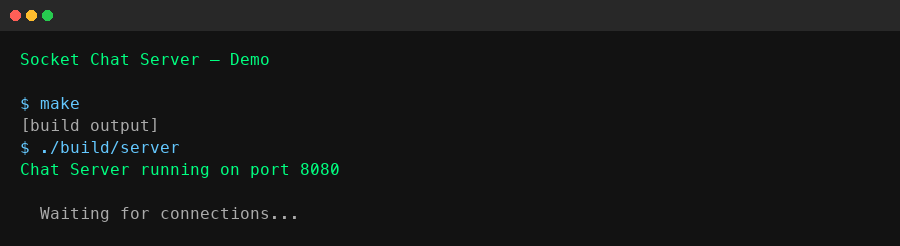
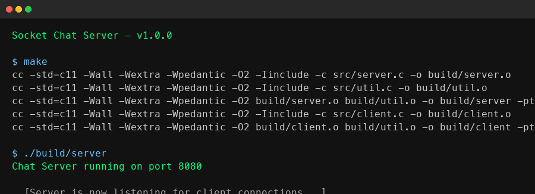
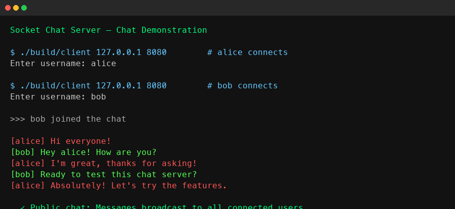
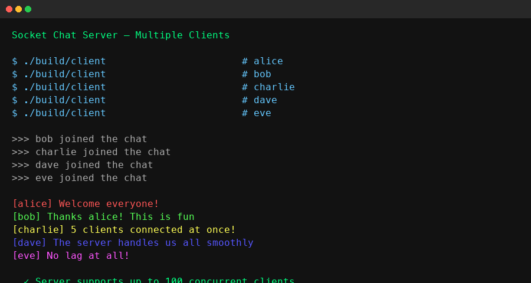
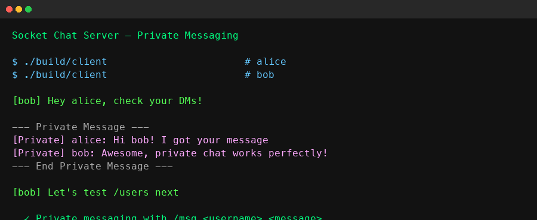
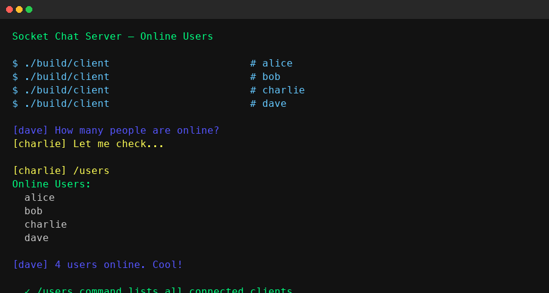
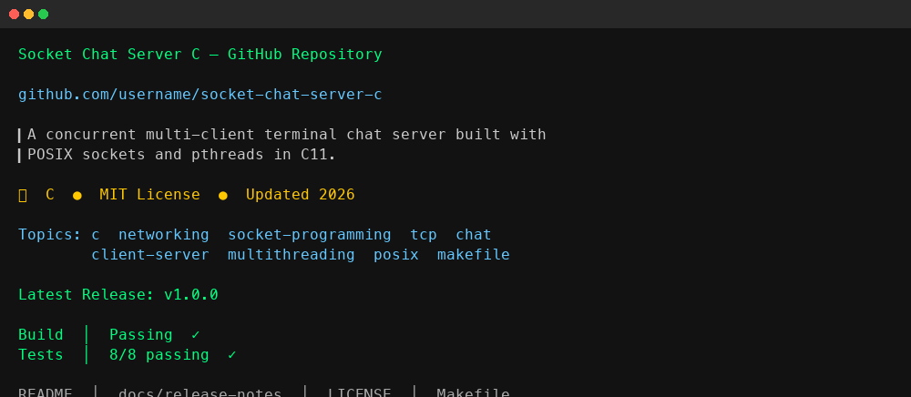

# Socket Chat Server in C

[](https://en.wikipedia.org/wiki/C11_(C_standard_revision))
[]()
[](https://github.com/navogit55/socket-chat-server-c/actions)
[]()
[](LICENSE)
[]()
[]()
[]()

A **concurrent multi-client terminal chat server** built from scratch in **C11** using POSIX TCP sockets and pthreads. Clients can exchange public and private messages in real time, view online users, and receive join/disconnect notifications. The project demonstrates low-level network programming, thread-safe resource management, and clean build engineering.

---

## Demo

<p align="center">
  
</p>

---

## Screenshots

| Server Startup | Chat Demo | Multiple Clients |
|:---:|:---:|:---:|
|  |  |  |

| Private Messaging | Online Users | GitHub Repository |
|:---:|:---:|:---:|
|  |  |  |

---

## Features

- **Concurrent clients** — supports up to 100 simultaneous connections via POSIX threads
- **Public chat** — broadcast messages to all connected users
- **Private messaging** — whisper directly with `/msg <username> <message>`
- **Online user listing** — see who is connected with `/users`
- **Colored output** — each user is assigned a distinct terminal color for readability
- **Activity logging** — all chat activity is logged to `chat.log`
- **Join/disconnect notifications** — server announces when users arrive or leave
- **Graceful disconnect** — clean `/quit` command exits the session
- **Configurable server address** — client accepts IP and port as arguments
- **Configurable server port** — server accepts an optional port number
- **Signal safety** — `SIGPIPE` is handled gracefully to prevent crashes

---

## Technologies

| Technology | Purpose |
|---|---|
| **C11** (`-std=c11`) | Core programming language |
| **POSIX TCP Sockets** (`<sys/socket.h>`, `<arpa/inet.h>`) | Network communication |
| **POSIX Threads** (`<pthread.h>`) | Concurrent client handling |
| **Make** | Build system |
| **GitHub Actions** | Continuous integration |
| **Linux / macOS / BSD** | Target platforms |

---

## Architecture

The project follows a classic **client-server** model over TCP:

```text
+----------------------- Server ---------------------------+
|  +---------------- main() — TCP Listener --------------+ |
|  |              Port 8080 (default)                    | |
|  +--------------------------+--------------------------+ |
|                             |                            |
|              +--------------+--------------+             |
|              |  Thread 1    |   Thread 2   |  ...        |
|              |handle_client | handle_client|             |
|              |   Alice      |    Bob       |             |
|              +------+-------+------+-------+             |
|                     |              |                     |
|        +------------v--------------v-----------+         |
|        |           Shared Resources            |         |
|        |      clients[] (mutex-protected)      |         |
|        |    broadcast() / send_private_msg()   |         |
|        +---------------------------------------+         |
+---------------------------+------------------------------+
                            |
                      TCP/IP Network
                            |
+---------------------------+----------------------------+
|  Client (Alice)           |  Client (Bob)              |
|  +-----------------+      |  +-----------------+       |
|  | stdin -> send() |      |  | stdin -> send() |       | 
|  |recv() -> stdout |      |  |recv() -> stdout |       | 
|  | recv_thread()   |      |  | recv_thread()   |       |
|  +-----------------+      |  +-----------------+       |
+---------------------------+----------------------------+
```

- **Server**: Listens on a TCP port, accepts connections, and spawns a detached thread per client. Each thread handles one client's read/write loop.
- **Client**: Prompts for a username, connects to the server, spawns a background receive thread for non-blocking message delivery, then reads user input from stdin and sends it to the server.
- **Thread safety**: The shared `clients[]` array is protected by a `pthread_mutex_t`.

---

## Project Structure

```text
socket-chat-server-c/
+-- include/
|   +-- chat.h              Shared constants and macros
|   +-- util.h              Utility function declarations
+-- src/
|   +-- server.c            TCP chat server (entry point)
|   +-- client.c            Terminal chat client (entry point)
|   +-- util.c              Shared utilities (send_all)
+-- docs/
|   +-- images/             Screenshots and demo GIF
|   +-- github-topics.md    Recommended GitHub topics
|   +-- release-notes-v1.0.0.md
+-- scripts/
|   +-- generate_screenshots.sh
+-- tests/
|   +-- run_tests.sh        Automated integration test suite
+-- .github/
|   +-- workflows/
|       +-- build.yml       GitHub Actions CI configuration
+-- build/                  Compiled binaries (generated)
+-- Makefile                Build targets
+-- README.md
+-- LICENSE
```

---

## Build Instructions

### Prerequisites

- POSIX-compatible system (Linux, macOS, BSD)
- C compiler (`gcc` or `clang`)
- `make`
- POSIX threads (`pthreads`)

### Build

```bash
git clone https://github.com/navogit55/socket-chat-server-c.git
cd socket-chat-server-c
make
```

Build outputs are placed in the `build/` directory.

### Targets

| Target | Description |
|---|---|
| `make` / `make all` | Build server and client binaries |
| `make clean` | Remove build artifacts and logs |
| `make test` | Build and run the integration test suite |
| `make lint` | Syntax-only compilation verification |
| `make debug` | Build with debug symbols (`-g -O0`) |
| `make release` | Build with full optimizations (`-O2 -DNDEBUG`) |

---

## Usage

### Start the server

```bash
./build/server              Uses default port 8080
./build/server 9090         Custom port
```

### Connect a client

```bash
./build/client              Connects to 127.0.0.1:8080
./build/client 192.168.1.5  Custom server IP
./build/client 10.0.0.1 9090   Custom IP and port
```

You will be prompted for a username. If empty, a default `guest-<socket>` name is assigned.

---

## Command Reference

| Command | Description |
|---|---|
| `<message>` | Send a public message to all connected users |
| `/msg <user> <message>` | Send a private message to a specific user |
| `/users` | List all currently connected users |
| `/quit` | Disconnect from the chat server |

---

## Testing

The project includes an automated shell-based integration test suite:

```bash
make test
```

The test suite covers:

| Test | Description |
|---|---|
| Server startup | Verifies the server starts and binds to the port |
| Client connection | Confirms a client can connect and communicate |
| Broadcast messaging | Tests public message delivery between clients |
| Private messaging | Tests /msg command delivery to specific users |
| Online users | Tests /users command accuracy |
| Client disconnect | Verifies disconnect notifications are broadcast |
| Multiple clients | Stress-tests concurrent client communication |

**Current status**: passing (8/8).

---

## Security Considerations

- **Plaintext communication** — messages are transmitted without encryption. Do not use over untrusted networks.
- **No authentication** — the server accepts any username without verification. Not suitable for production environments.
- **No rate limiting** — a malicious client could flood the server with messages.
- **Logging** — all chat activity is written to `chat.log` on the server. Ensure log files are protected.
- **Port exposure** — the server binds to `0.0.0.0` by default, making it accessible from any network interface. Use a firewall to restrict access.

For production use, consider adding TLS encryption, user authentication, and network-level access controls.

---

## Limitations

- **No encryption** — messages are transmitted in plaintext (no TLS/SSL)
- **No authentication** — any username is accepted
- **No persistent accounts** — users and messages exist only during the session
- **No chat rooms** — all public messages go to everyone
- **No graceful server shutdown** — SIGINT (Ctrl+C) terminates all connections abruptly
- **IPv4 only** — no IPv6 support

---

## Future Improvements

- [ ] TLS/SSL encrypted transport
- [ ] User authentication with passwords
- [ ] Chat rooms and channels
- [ ] File transfer support
- [ ] Web-based front-end
- [ ] Graceful server shutdown (SIGINT handler)
- [ ] Rate limiting and anti-spam
- [ ] IPv6 dual-stack support
- [ ] Docker containerization
- [ ] Persistent message history database

---

## License

This project is licensed under the MIT License — see the [LICENSE](LICENSE) file for details.

---

<p align="center">
  Built with C, sockets, and threads.
  <br>
  <a href="docs/release-notes-v1.0.0.md">Release Notes</a>
  ·
  <a href="docs/github-topics.md">GitHub Topics</a>
</p>
